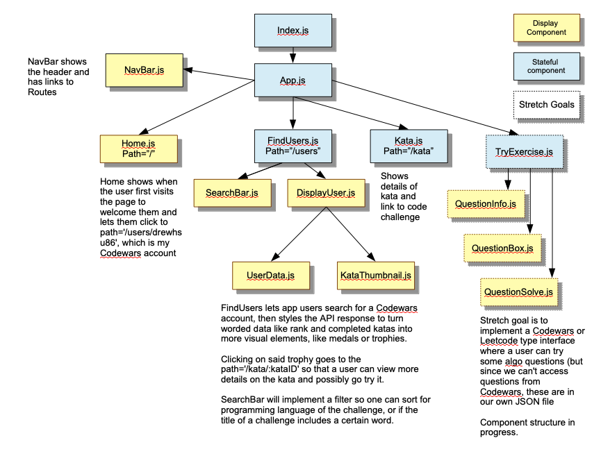

# Title: Knights of Coding

## Description
This app was made to show the code exercises I've done on Codewars.com, let people search for other Codewars accounts, and filter through different programming languages when looking which katas (code challenges) that they've done. They will be presented as convenient UI elements that let users quickly look at the language, title and rank of different katas. As opposed to the default Codewars theme, this app has a castle theme that aims to present katas as trophies on a trophy case. Stretch goals include a sub-area where the user try some of the easier algos. 

## Wireframes

For simplicity, the wireframes won't include post-mvp content but post-MVP content aims to share the same styles and responsiveness as the MVP app. Also, the browser view omits wireframes for the home and kata pages because they are the most straightforward.

#### Mobile wireframes

#### Browser wireframes 

## Component Hierarchy 

Some components in this draft may be further broken down with more components. Also this hierarchy tree does not include the folder structure of how the components are stored. The folders will probably correspond with the different Routes.

## API: Codewars API

[Link to Codewars API](https://dev.codewars.com/#get-user)

The Codewars API has one call to get info about a user account, and a second API call to get the code challenges (kata) done by the user. They also have an API call to get description information and a url link for each specific kata. This last API call I would have to make when the user clicks a button to get more details about a particular kata.

## MVP 
  * React app that uses React-router-dom
  * Aside from index.js and App.js, I plan to have at least 3 stateful components at least as many (probably 5) display components 
  * I plan to have a folder structure that separates components for each Route. The component tree will be as close as possible to my component hierarchy diagram.
  * I plan to use Axios calls to get the user data, and then another Axios call when a specific kata is clicked on.
  * I plan to not only style the page but I have a castle/knight aesthetic I want to implement with CSS and maybe some simple images I plan to draw. I will probably write the CSS in App.css to start but if it gets really long I will create and import separate CSS files inside each separate folder for each path. 
  * I will deploy via Surge or Netlify.
  * To fulfill basic MVP, I will make a Storybook setup to show my different styled components. I will probably have more than the minimum number of components because I plan to make some styled thumbnails and other aesthetic elements.
  * One of the features I would like to include as MVP is the ability to filter the completed kata list of the account that was searched, so the user can choose only a certain language or look for a word match within a title. Also I may put in the option to filter, or rank the list of katas by their rank (Codewars has it's own ranking system for katas).

## Post-MVP 
  * One of my more ambitious MVP goals is to use Javascript eval() to make an area where users can try some algo questions on my app. Unfortunately, Codewars does not give the test cases in their code challenges API call. Obviously, my version would have far fewer features than a site like Codewars or Leetcode but I have played around with this idea before and would like to try implementing it with a JSON file of questions of similar difficulty to our homework questions.
  * I would try to fulfill one of the other MVP goals of writing 15 jest tests for my app. These would probably test the functionality of the component using a JSON file, or I would have to do some search into using jest/enzyme with the async functional call that our API needs to make.  

## SWOT Analysis 
My strengths and one of my main interests is things like algorithms, and creating code to produce certain effects. Writing a Codewars type "code in this box" set up with some rudimentary testing is something I played with last week, and have thought about for a while (I have also used Leetcode which is similar) so I am interested in diving deeper for my post-MVP. Based on some of my early experiments, I can emulate a basic (and obviously much less robust) version of the "code in this box" formula as long as I had some test data in an array (unfortunately not available).

My usual weakness is both creativity and associated uncertainty. This time I wanted to tackle that by having a straight forward theme (knights and trophies to represent challenges). I also felt like Storybook and having a component library to easily access the aesthetic design choices was something I never considered doing, whereas testing was always on my mind before starting GA-sei (because sites like Codewars and Leetcode literally test your code before letting you pass the challenge). 

Another expected blocker for post-MVP is testing components that need to complete an API call to show results. I have not researched that at all in the pre-project stage so I will make a note of that in the SWOT analysis.

I think the main threat is not carefully guiding myself between the lines of having a project that is too simple, versus having an unfinished project by having unrealistic goals. I hope that by setting the basic MVP slightly simpler, I can use an iterative process and post MVP goals to take the project to a higher level.

## Timeframes 

Estimated times filled in and completed time to be filled in:

| Activity | Estimated Time (hrs) | Actual Time (hrs) |
| -------- | -------------- | ----------- |
| __Monday__ | April 26 | |
| Project Approval | <= 1 | |
| Basic React App with Nav and Routes | 0.5 | |
| Home route: basic page with text and buttons | 0.5 | | 
| Find users route: API call and display user data | 1 | |
| User data components such as kata thumbnails | 3 | |
| Kata route: send parameters and display on new component | 2 | |
| __Tuesday__ | April 27 | |
| Install Storybook and make library of components | 4 | |
| Continue CSS | 2 | |
| Kata filtering system pt.1 | 2 | |
| __Wednesday__ | April 28 | |
| Kata filtering system pt.2 | 6 | |
| Continue CSS and Storybook | 2 | |
| __Thursday (post-MVP)__ | April 29 | |
| Post-MVP code-in-this-box with eval() | 5 | |
| Jest/Enzyme testing | 3 |  |
